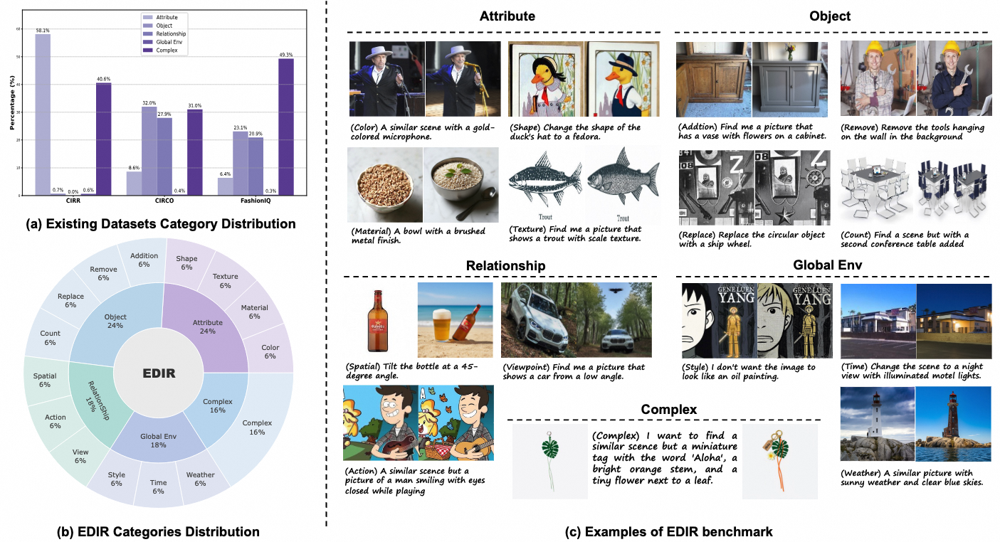

# README

[](https://arxiv.org/abs/2601.16125)

Official repository for the paper [Rethinking Composed Image Retrieval Evaluation: A Fine-Grained
Benchmark from Image Editing](https://arxiv.org/abs/2601.16125). 

 

**Notice** : The dataset will be released in next two months on HF. 

## 1 Quick Start 

```sh
pip install -r requirements.txt
python main.py --model_id "rzen-7b" --model_name_or_path "" --dataset test 
```

## 2 Evaluation 

[Download]() the EDIR dataset to dataset/edir.  
```
python main.py --model_id "rzen-7b" --model_name_or_path "" --dataset edir --dataset_path [the path to the images] 
```

To evaluate your own model, please refer to the models directory and implement your own model. 
To add a new dataset, please refer to the format of the test directory. 

## Citation
If you find this work useful, you can cite our paper:
```bibtex
@misc{song2026edir,
      title={Rethinking Composed Image Retrieval Evaluation: A Fine-Grained Benchmark from Image Editing}, 
      author={Tingyu Song and Yanzhao Zhang and Mingxin Li and Zhuoning Guo and Dingkun Long and Pengjun Xie and Siyue Zhang and Yilun Zhao and Shu Wu},
      year={2026},
      eprint={2601.16125},
      archivePrefix={arXiv},
      primaryClass={cs.CV},
      url={https://arxiv.org/abs/2601.16125}, 
}
```
